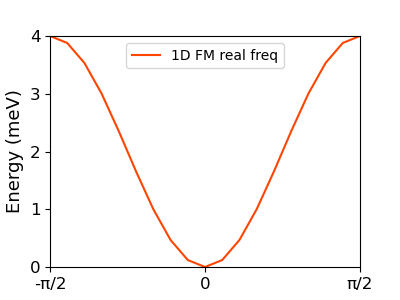

* This section describes the example calculation. The first example is a 1D FM chain. 

###  `example/example1_1D_FM.jl`
```
# 1D FM chain

import SpinMax

lattice_vec = [  # lattice vectors in cartesian, Unit: Angstrom
[1,0,0],
[0,1,0],
[0,0,1],
]

NumAtom = 1    # Number of Spins
AtomPosSpins = [
[[0,0,0]    ,[1],[0,0]], # fractional coordinates, spin number, spin direction [theta,phi]
]

#[[atom1, atom2], [a1,a2,a3], [Jxx Jxy Jxz; Jyx Jyy Jyz; Jzx Jzy Jzz]],
exchanges = [ 
[[1,1],  [-1,0,0],  [-1/2 0 0; 0  -1/2 0; 0 0 -1/2]],
[[1,1],  [+1,0,0],  [-1/2 0 0; 0  -1/2 0; 0 0 -1/2]],
]

#single-ion anisotropy
anisotropy_K = [
  [[1], [0 0 0 ; 0 0 0; 0 0 0]],
]

kpaths = [
 20   -0.5 0.0 0.0   0.0 0.0 0.0
 20    0.0 0.0 0.0   0.5 0.0 0.0
]

kgrids = [200,1,1]


### Calculation parts: 
# anisotropy keyword is optional. Unless using it, the single-ion anisotropies are set to 0. 
# magnon band
SpinMax.band(lattice_vec, NumAtom, AtomPosSpins, exchanges, kpaths, anisotropy=anisotropy_K)

# magnon spectral function
SpinMax.spectra(lattice_vec, NumAtom, AtomPosSpins, exchanges,kpaths, anisotropy = anisotropy_K, Emin=0.1, Emax=5.0, Egrid=0.1, Temperature=100)

# magnon dos
SpinMax.dos(lattice_vec, NumAtom, AtomPosSpins, exchanges, kgrids, anisotropy = anisotropy_K, Emin = 0.0, Emax = 5.0, Egrid = 0.1)

### Plot parts:
SpinMax.plot_band()

SpinMax.plot_spectra("xx") 
# you can change the parameter: "xx", "xy", "xz", "yx", "yy", "yz", "zx", "zy", "zz"

SpinMax.plot_dos(0.15)
# the paramter is the sigma for gaussian broadening.

```
### run julia script
```bash
$ cd example/
$ julia example/1D_FM.jl
```

### Plot
``` julia
julia> import SpinMax
julia> SpinMax.plot_band()    # band
julia> SpinMax.plot_spectra() # spectral 
julia> SpinMax.plot_dos()     # dos
```
Plot scripts (Python/Julia) are also provided in `plots` directory.

``` bash
$ python plot_example.py
```

