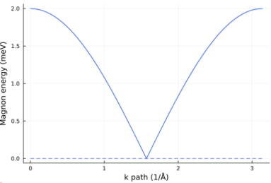

```
# 1D AFM chain

import SpinMax

lattice_vec = [
[2,0,0],
[0,1,0],
[0,0,1],
]

NumAtom = 2

AtomPosSpins = [
[[0,0,0]    ,[1], [0,0]],
[[1/2,0,0]  ,[1], [180,0]],
]


#[atom1, atom2], [a1,a2,a3], [J1,J2,J3,J4,J5,J6,J7,J8,J9]
exchanges = [
[[1,2],  [ 0,0,0],  [1/2 0 0; 0  1/2 0; 0 0 1/2]],
[[1,2],  [-1,0,0],  [1/2 0 0; 0  1/2 0; 0 0 1/2]],
[[2,1],  [+1,0,0],  [1/2 0 0; 0  1/2 0; 0 0 1/2]],
[[2,1],  [ 0,0,0],  [1/2 0 0; 0  1/2 0; 0 0 1/2]],
]

anisotropy_K = [
  [[1], [0 0 0 ; 0 0 0; 0 0 0]],
  [[2], [0 0 0 ; 0 0 0; 0 0 0]],
]

kpaths = [
 30   -0.5 0.0 0.0   0.0 0.0 0.0
 30    0.0 0.0 0.0   0.5 0.0 0.0
]

kgrids = [200,1,1]

SpinMax.band(lattice_vec, NumAtom, AtomPosSpins, exchanges, kpaths, anisotropy=anisotropy_K)
SpinMax.spectra(lattice_vec, NumAtom, AtomPosSpins, exchanges,kpaths, anisotropy = anisotropy_K, Emin=0.01, Emax=5.0, Egrid=0.1, Temperature=100)
SpinMax.dos(lattice_vec, NumAtom, AtomPosSpins, exchanges, kgrids, anisotropy = anisotropy_K, Emin = 0.0, Emax = 5.0, Egrid = 0.1)

SpinMax.plot_band()
SpinMax.plot_spectra("xx")
SpinMax.plot_dos(0.15)

```
