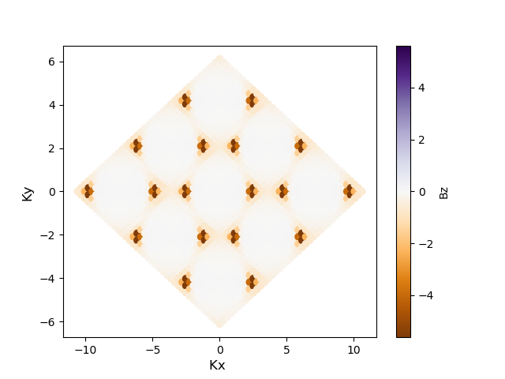

This example explains a magnon in the ferromagnetic honeycomb with Dzyaloshinskii-Moriya (DM) interaction. This example gives the Berry curvature as well as the magnon band and dos.

```julia
import SpinMax

a = sqrt(3)
lattice_vec = [
 [  a*cos(pi/3),  -a*sin(pi/3),   0.0],
 [  a*cos(pi/3),   a*sin(pi/3),   0.0],
 [          0.0,           0.0,  10.0],
]

NumAtom = 2

AtomPosSpins = [
[ [1/3, 2/3, 0.0], [1], [0,0]],
[ [2/3, 1/3, 0.0], [1], [0,0]],
]


#[atom1, atom2], [a1,a2,a3], [J1,J2,J3,J4,J5,J6,J7,J8,J9]

anisotropy_K = [
  [[1], [0 0 0 ; 0 0 0; 0 0 -0.5]],
  [[2], [0 0 0 ; 0 0 0; 0 0 -0.5]],
]

J1 = 2.0
J2 = 0.0
DM = 0.1

exchanges = [
[[1,2],  [ 0, 0, 0], [ -J1 0 0; 0 -J1 0; 0 0  -J1]], #1st NN
[[1,2],  [ 0, 1, 0], [ -J1 0 0; 0 -J1 0; 0 0  -J1]], #1st NN
[[1,2],  [-1, 0, 0], [ -J1 0 0; 0 -J1 0; 0 0  -J1]], #1st NN
[[2,1],  [ 0, 0, 0], [ -J1 0 0; 0 -J1 0; 0 0  -J1]], #1st NN
[[2,1],  [ 0,-1, 0], [ -J1 0 0; 0 -J1 0; 0 0  -J1]], #1st NN
[[2,1],  [ 1, 0, 0], [ -J1 0 0; 0 -J1 0; 0 0  -J1]], #1st NN

[[1,1],  [ 1, 0, 0], [ -J2  DM 0; -DM -J2 0; 0 0  -J2]], #2nd NN
[[1,1],  [ 0, 1, 0], [ -J2  DM 0; -DM -J2 0; 0 0  -J2]], #2nd NN
[[1,1],  [-1,-1, 0], [ -J2  DM 0; -DM -J2 0; 0 0  -J2]], #2nd NN
[[1,1],  [-1, 0, 0], [ -J2 -DM 0;  DM -J2 0; 0 0  -J2]], #2nd NN
[[1,1],  [ 0,-1, 0], [ -J2 -DM 0;  DM -J2 0; 0 0  -J2]], #2nd NN
[[1,1],  [ 1, 1, 0], [ -J2 -DM 0;  DM -J2 0; 0 0  -J2]], #2nd NN
[[2,2],  [ 1, 0, 0], [ -J2 -DM 0;  DM -J2 0; 0 0  -J2]], #2nd NN
[[2,2],  [ 0, 1, 0], [ -J2 -DM 0;  DM -J2 0; 0 0  -J2]], #2nd NN
[[2,2],  [-1,-1, 0], [ -J2 -DM 0;  DM -J2 0; 0 0  -J2]], #2nd NN
[[2,2],  [-1, 0, 0], [ -J2  DM 0; -DM -J2 0; 0 0  -J2]], #2nd NN
[[2,2],  [ 0,-1, 0], [ -J2  DM 0; -DM -J2 0; 0 0  -J2]], #2nd NN
[[2,2],  [ 1, 1, 0], [ -J2  DM 0; -DM -J2 0; 0 0  -J2]], #2nd NN
]


kpaths = [
45    0.0000   0.0000   0.0000        0.3333   0.3333   0.0000  # G K
25    0.3333   0.3333   0.0000        0.5000   0.5000   0.0000  # K M
25    0.5000   0.5000   0.0000        0.6667   0.6667   0.0000  # M K
45    0.6667   0.6667   0.0000        1.0000   1.0000   0.0000  # K G
]

kgrids = [41,41,1]

Chern_plane_vec = lattice_vec
Chern_grids = [13,13,1]

SpinMax.band(lattice_vec, NumAtom, AtomPosSpins, exchanges,  kpaths, anisotropy = anisotropy_K)
SpinMax.spectra(lattice_vec, NumAtom, AtomPosSpins, exchanges, kpaths, anisotropy = anisotropy_K, Emin = 1.2, Emax = 20.0, Egrid = 0.4, Temperature = 200)
SpinMax.dos(lattice_vec, NumAtom, AtomPosSpins, exchanges, kgrids, anisotropy = anisotropy_K, Emin = 0.0, Emax = 30.0, Egrid = 0.1)
SpinMax.magnon_chern(lattice_vec, NumAtom,AtomPosSpins,  exchanges, Chern_grids, Chern_plane_vec,  anisotropy = anisotropy_K)

```

The correlation function (spectra) can be plotted as the below figure. 


The Berry curvature of magnon is plotted. 



The Chern number is written in `Chern.txt`. 
```
1 0.927
2 -0.927
```
