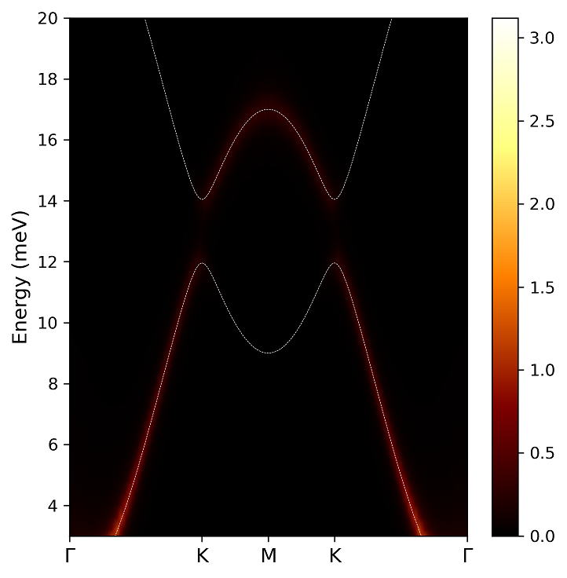

# SpinMax.jl
`SpinMax.jl` is a software for calculating magnon dispersions, spectra, and topology based on linear spin wave theory using Holstein-Primakoff transformation. Its quasi-particle excitations are described in a bosonic basis. 

This magnonic excitation is calculated with 'spin lattice information' and 'magnetic exchange interactions'. Of course, the magnetic exchange interaction can be manually identified by users.

Another way to establish the exchange interactions is 'magnetic force theorem' or 'magnetic force linear response theory' (MFT) method. 
`SpinMax.jl` supports the interface conneting to [`jx.jl`](https://kaist-elst.github.io/Jx.jl/), which is supporting MFT from electronic structure calculations (openMX, openMX-Wannier, Wannier90, LOBSTER, ecalJ-QSGW).

`SpinMax.jl` is written based in Julia language. `SpinMax.jl` is tested under Julia ver. 1.6-1.9.

##### Developer: [Do Hoon Kiem](https://dhkiem.github.io/) 

## Capability and features
#### Physical features
* Exchange interactions as full tensors including Heisenberg, DMI, Kitaev-Γ
* Single-ion anisotropy
* Arbitrary spin angles using Euler rotation
* Magnon band dispersion
* Spectra (k,E-resolved Correlation function)
* Density of states
* Berry curvature and Chern number calculation

#### Computational Utilities
* Compatible with MFT package `Jx.jl` outputs
* Checking Hermitian
* Parallel computing 
* Both for REPL and Command lines
* Plotting tools


## Installation 

The code will be open soon.
### git clone
```bash
$ git clone https://github.com/DHKiem/SpinMaX_dev.jl.git
$ cd SpinMax_dev.jl
$ julia ./install_spinmax.jl
```

or

### add in julia REPL
``` bash
$ julia
] add https://github.com/DHKiem/SpinMax_dev.jl
```


## How to USE
For the calculation, `import SpinMax` in julia REPL.
```
$ julia
julia> import SpinMax
```

A recommendation is using `magnon_input.jl` file as described in `example`. It contains input parameters for lattice information, band paths, and computational options etc.
Then, run the `magnon_input.jl`.
```bash
$ julia magnon_input.jl
```

For a parallel computing, `Distributed` package is used. 
```
$ julia -p 4
julia> using Distributed
julia> @everywhere import SpinMax
```
Tip) Parallelization is recommended for large number of spins.


## Example
### 1D FM chain
* This section describes the example calculation. The first example is a 1D FM chain. 

###  `1D_FM_input.jl`
```
# 1D FM chain

import SpinMax

lattice_vec = [  # lattice vectors in cartesian, Unit: Angstrom
[1,0,0],
[0,1,0],
[0,0,1],
]

NumAtom = 1    # Number of Spins
AtomPosSpins = [
[[0,0,0]    ,[1],[0,0]], # fractional coordinates, spin number, spin direction [theta,phi]
]

#[[atom1, atom2], [a1,a2,a3], [Jxx Jxy Jxz; Jyx Jyy Jyz; Jzx Jzy Jzz]],
exchanges = [ 
[[1,1],  [-1,0,0],  [-1/2 0 0; 0  -1/2 0; 0 0 -1/2]],
[[1,1],  [+1,0,0],  [-1/2 0 0; 0  -1/2 0; 0 0 -1/2]],
]

#single-ion anisotropy
anisotropy_K = [  
  [[1], [0 0 0 ; 0 0 0; 0 0 0]], # [[atom number], K tensor]
]

kpaths = [  
# number_of_grid   kx1 ky1 kz1    kx2 ky2 kz2
 10   -0.5 0.0 0.0   0.0 0.0 0.0  
 10    0.0 0.0 0.0   0.5 0.0 0.0
]

#SpinMax.band(lattice_vec, NumAtom, AtomPosSpins, exchanges, kpaths)
SpinMax.band(lattice_vec, NumAtom, AtomPosSpins, exchanges, kpaths, anisotropy = anisotropy_K) # anisotropy keyword is optional. Unless using it, the single-ion anisotropies are set to 0. 
```
### run julia script
```bash
$ cd example/1D_FM
$ julia 1D_FM_input.jl
```

The example plots are provided as the python and Julia scripts.
``` bash
$ python plot_example.py
$ julia ../../plots/plot_band.jl
```


### NiO (combined with Jx.jl)
The exchange interactions can be taken from `Jx.jl` output as csv files. The converting function is `SpinMax.jx_col(filename, fm)`. If two spins have ferromagnetic configuration, the last argument 'fm' is refered as 1. For an antiferromagnet, fm = -1.

```
#[atom1, atom2], [a1,a2,a3], [J1,J2,J3,J4,J5,J6,J7,J8,J9]
exchanges = [
    SpinMax.jx_col("jx2.col.spin_nio_atomij_1_1_[all_all]_ChemPdelta_0.0.csv",1),
    SpinMax.jx_col("jx2.col.spin_nio_atomij_1_2_[all_all]_ChemPdelta_0.0.csv",-1),
    SpinMax.jx_col("jx2.col.spin_nio_atomij_2_1_[all_all]_ChemPdelta_0.0.csv",-1),
    SpinMax.jx_col("jx2.col.spin_nio_atomij_2_2_[all_all]_ChemPdelta_0.0.csv",1)
]
```


### Honeycomb lattice with DMI
```
import SpinMax

a = sqrt(3)
lattice_vec = [
 [  a*cos(pi/3),  -a*sin(pi/3),   0.0],
 [  a*cos(pi/3),   a*sin(pi/3),   0.0],
 [          0.0,           0.0,  10.0],
]

NumAtom = 2

AtomPosSpins = [
[ [1/3, 2/3, 0.0], [1], [0,0]],
[ [2/3, 1/3, 0.0], [1], [0,0]],
]


#[atom1, atom2], [a1,a2,a3], [J1,J2,J3,J4,J5,J6,J7,J8,J9]

anisotropy_K = [
  [[1], [0 0 0 ; 0 0 0; 0 0 -0.5]],
  [[2], [0 0 0 ; 0 0 0; 0 0 -0.5]],
]

J1 = 2.0
J2 = 0.0
DM = 0.1

exchanges = [
[[1,2],  [ 0, 0, 0], [ -J1 0 0; 0 -J1 0; 0 0  -J1]], #1st NN
[[1,2],  [ 0, 1, 0], [ -J1 0 0; 0 -J1 0; 0 0  -J1]], #1st NN
[[1,2],  [-1, 0, 0], [ -J1 0 0; 0 -J1 0; 0 0  -J1]], #1st NN
[[2,1],  [ 0, 0, 0], [ -J1 0 0; 0 -J1 0; 0 0  -J1]], #1st NN
[[2,1],  [ 0,-1, 0], [ -J1 0 0; 0 -J1 0; 0 0  -J1]], #1st NN
[[2,1],  [ 1, 0, 0], [ -J1 0 0; 0 -J1 0; 0 0  -J1]], #1st NN

[[1,1],  [ 1, 0, 0], [ -J2  DM 0; -DM -J2 0; 0 0  -J2]], #2nd NN
[[1,1],  [ 0, 1, 0], [ -J2  DM 0; -DM -J2 0; 0 0  -J2]], #2nd NN
[[1,1],  [-1,-1, 0], [ -J2  DM 0; -DM -J2 0; 0 0  -J2]], #2nd NN
[[1,1],  [-1, 0, 0], [ -J2 -DM 0;  DM -J2 0; 0 0  -J2]], #2nd NN
[[1,1],  [ 0,-1, 0], [ -J2 -DM 0;  DM -J2 0; 0 0  -J2]], #2nd NN
[[1,1],  [ 1, 1, 0], [ -J2 -DM 0;  DM -J2 0; 0 0  -J2]], #2nd NN
[[2,2],  [ 1, 0, 0], [ -J2 -DM 0;  DM -J2 0; 0 0  -J2]], #2nd NN
[[2,2],  [ 0, 1, 0], [ -J2 -DM 0;  DM -J2 0; 0 0  -J2]], #2nd NN
[[2,2],  [-1,-1, 0], [ -J2 -DM 0;  DM -J2 0; 0 0  -J2]], #2nd NN
[[2,2],  [-1, 0, 0], [ -J2  DM 0; -DM -J2 0; 0 0  -J2]], #2nd NN
[[2,2],  [ 0,-1, 0], [ -J2  DM 0; -DM -J2 0; 0 0  -J2]], #2nd NN
[[2,2],  [ 1, 1, 0], [ -J2  DM 0; -DM -J2 0; 0 0  -J2]], #2nd NN
]


kpaths = [
45    0.0000   0.0000   0.0000        0.3333   0.3333   0.0000  # G K
25    0.3333   0.3333   0.0000        0.5000   0.5000   0.0000  # K M
25    0.5000   0.5000   0.0000        0.6667   0.6667   0.0000  # M K
45    0.6667   0.6667   0.0000        1.0000   1.0000   0.0000  # K G
]

kgrids = [41,41,1]

Chern_plane_vec = lattice_vec
Chern_grids = [13,13,1]

SpinMax.band(lattice_vec, NumAtom, AtomPosSpins, exchanges,  kpaths, anisotropy = anisotropy_K)
SpinMax.spectra(lattice_vec, NumAtom, AtomPosSpins, exchanges, kpaths, anisotropy = anisotropy_K, Emin = 1.2, Emax = 20.0, Egrid = 0.4, Temperature = 200)
SpinMax.dos(lattice_vec, NumAtom, AtomPosSpins, exchanges, kgrids, anisotropy = anisotropy_K, Emin = 0.0, Emax = 30.0, Egrid = 0.1)
SpinMax.magnon_Chern(lattice_vec, Chern_plane_vec, NumAtom, AtomPosSpins, exchanges, anisotropy_K, Chern_grids)

```

The correlation function (spectra) can be plotted as the below figure. 



The Berry curvature of magnon is plotted. 


The Chern number is written in `Chern.txt`. 
```
1 0.927
2 -0.927
```
