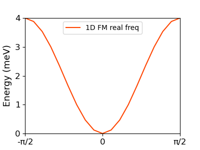

# SpinMaX.jl
`SpinMax.jl` is the software for calculating magnon dispersion, spectra, and topology based on 'quantum mechanical' linear spin wave theory. Its quasi-particle excitations are described in a bosonic basis. 

This magnonic excitation is calculated with 'spin lattice information' and 'magnetic exchange interactions'. Of course, the magnetic exchange interaction can be manually identified by users.

Another way to establish the exchange interaction is 'magnetic force theorem' or 'magnetic force linear response theory' (MFT) method. 
`SpinMax.jl` supports the interface conneting to [`jx.jl`](https://kaist-elst.github.io/Jx.jl/), which is supporting MFT from electronic structure calculations (openMX, openMX-Wannier, Wannier90, LOBSTER, ecalJ-QSGW).

`SpinMax.jl` is written based in Julia language. 

##### Developer: [Do Hoon Kiem](https://dhkiem.github.io/) 

## Capability
* Band dispersion
* k,E-resolved Correlation function 
* Density of states 
* Berry curvature and Chern number calculation

## Installation 

### git clone
```bash
$ git clone https://github.com/DHKiem/SpinMaX_dev.jl.git
$ cd SpinMax_dev.jl
$ julia ./install_SpinMax.jl
```

or

### add in julia REPL
``` bash
$ julia
] add https://github.com/DHKiem/SpinMaX_dev.jl
```


## USE
For the calculation, `import SpinMax` in julia REPL.
Recommendation is using `magnon_input.jl` file. It contains input parameters for lattice information, band paths, and computational options etc.
Then, run the `magnon_input.jl`.
```bash
$ julia magnon_input.jl
```


## Example
### 1D FM chain
* This section describes the example calculation. The first example is a 1D FM chain. 

```
# 1D FM chain

import SpinMax

lattice_vec = [
[1,0,0],
[0,1,0],
[0,0,1],
]

NumAtom = 1
AtomPosSpins = [
[[0,0,0]    ,[1],[0,0]], # cell, spin, [theta,phi]
]

#[atom1, atom2], [a1,a2,a3], [J1,J2,J3,J4,J5,J6,J7,J8,J9]
exchanges = [
[[1,1],  [-1,0,0],  [-1/2 0 0; 0  -1/2 0; 0 0 -1/2]],
[[1,1],  [+1,0,0],  [-1/2 0 0; 0  -1/2 0; 0 0 -1/2]],
]

#single-ion anisotropy
anisotropy_K = [ 
  [[1], [0 0 0 ; 0 0 0; 0 0 0]],
]

kpaths = [
 10   -0.5 0.0 0.0   0.0 0.0 0.0
 10    0.0 0.0 0.0   0.5 0.0 0.0
]

SpinMax.band(lattice_vec, NumAtom, AtomPosSpins, exchanges, anisotropy_K, kpaths)
```

``` bash
python plot_example.py
```



### NiO (combined with Jx.jl)


### Honeycomb lattice with DMI
```
import spinmax_dev

a = sqrt(3)
lattice_vec = [
 [  a*cos(pi/3),  -a*sin(pi/3),   0.0],
 [  a*cos(pi/3),   a*sin(pi/3),   0.0],
 [          0.0,           0.0,  10.0],
]

NumAtom = 2

AtomPosSpins = [
[ [1/3, 2/3, 0.0], [1], [0,0]],
[ [2/3, 1/3, 0.0], [1], [0,0]],
]


#[atom1, atom2], [a1,a2,a3], [J1,J2,J3,J4,J5,J6,J7,J8,J9]

anisotropy_K = [
  [[1], [0 0 0 ; 0 0 0; 0 0 -0.5]],
  [[2], [0 0 0 ; 0 0 0; 0 0 -0.5]],
]

J1 = 2.0
J2 = 0.0
DM = 0.1

exchanges = [
[[1,2],  [ 0, 0, 0], [ -J1 0 0; 0 -J1 0; 0 0  -J1]], #1st NN
[[1,2],  [ 0, 1, 0], [ -J1 0 0; 0 -J1 0; 0 0  -J1]], #1st NN
[[1,2],  [-1, 0, 0], [ -J1 0 0; 0 -J1 0; 0 0  -J1]], #1st NN
[[2,1],  [ 0, 0, 0], [ -J1 0 0; 0 -J1 0; 0 0  -J1]], #1st NN
[[2,1],  [ 0,-1, 0], [ -J1 0 0; 0 -J1 0; 0 0  -J1]], #1st NN
[[2,1],  [ 1, 0, 0], [ -J1 0 0; 0 -J1 0; 0 0  -J1]], #1st NN

[[1,1],  [ 1, 0, 0], [ -J2  DM 0; -DM -J2 0; 0 0  -J2]], #2nd NN
[[1,1],  [ 0, 1, 0], [ -J2  DM 0; -DM -J2 0; 0 0  -J2]], #2nd NN
[[1,1],  [-1,-1, 0], [ -J2  DM 0; -DM -J2 0; 0 0  -J2]], #2nd NN
[[1,1],  [-1, 0, 0], [ -J2 -DM 0;  DM -J2 0; 0 0  -J2]], #2nd NN
[[1,1],  [ 0,-1, 0], [ -J2 -DM 0;  DM -J2 0; 0 0  -J2]], #2nd NN
[[1,1],  [ 1, 1, 0], [ -J2 -DM 0;  DM -J2 0; 0 0  -J2]], #2nd NN
[[2,2],  [ 1, 0, 0], [ -J2 -DM 0;  DM -J2 0; 0 0  -J2]], #2nd NN
[[2,2],  [ 0, 1, 0], [ -J2 -DM 0;  DM -J2 0; 0 0  -J2]], #2nd NN
[[2,2],  [-1,-1, 0], [ -J2 -DM 0;  DM -J2 0; 0 0  -J2]], #2nd NN
[[2,2],  [-1, 0, 0], [ -J2  DM 0; -DM -J2 0; 0 0  -J2]], #2nd NN
[[2,2],  [ 0,-1, 0], [ -J2  DM 0; -DM -J2 0; 0 0  -J2]], #2nd NN
[[2,2],  [ 1, 1, 0], [ -J2  DM 0; -DM -J2 0; 0 0  -J2]], #2nd NN
]


kpaths = [
45    0.0000   0.0000   0.0000        0.3333   0.3333   0.0000  # G K
25    0.3333   0.3333   0.0000        0.5000   0.5000   0.0000  # K M
25    0.5000   0.5000   0.0000        0.6667   0.6667   0.0000  # M K
45    0.6667   0.6667   0.0000        1.0000   1.0000   0.0000  # K G
]


Emin = 1.2
Egrid = 0.4
Emax = 20.0
Temperature = 200
kgrids = [13,13,1]

Chern_plane_vec = lattice_vec
Chern_grids = [13,13,1]

#spinmax_dev.band(lattice_vec, NumAtom, AtomPosSpins, exchanges, anisotropy_K, kpaths)
spinmax_dev.spectra(lattice_vec, NumAtom, AtomPosSpins, exchanges, anisotropy_K, kpaths, Emin, Emax, Egrid, Temperature)
spinmax_dev.magnon_Chern(lattice_vec, Chern_plane_vec, NumAtom, AtomPosSpins, exchanges, anisotropy_K, Chern_grids)

```


The Chern number is written in `Chern.txt`.
```
1 0.927
2 -0.927
```
